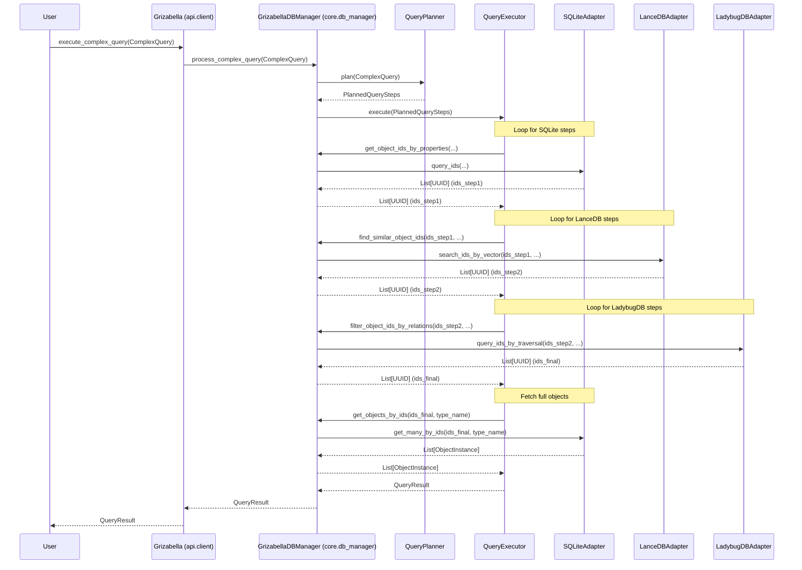
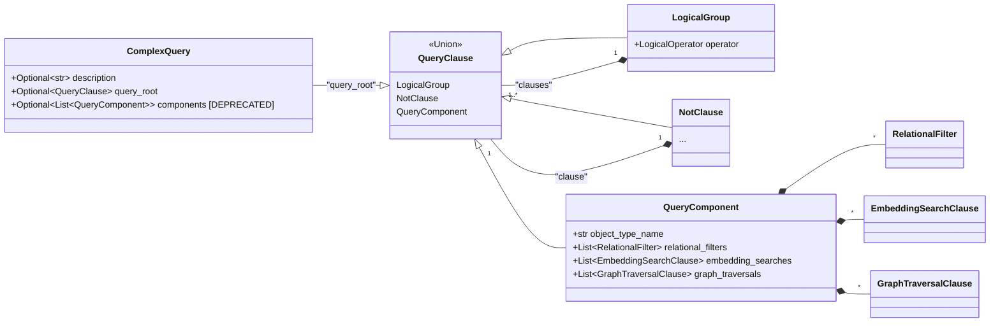

# Grizabella Complex Query Engine Design (Subtask 4.3)

**Date:** 2025-06-04

**Author:** Roo (AI Technical Leader)

**Version:** 1.0

## 1. Introduction

This document outlines the design for a complex query engine within the Grizabella project. The engine will enable users to execute queries that span across Grizabella's integrated database layers: SQLite (relational), LanceDB (vector), and LadybugDB (graph). The goal is to provide a unified way to parse, plan, execute, and aggregate results for such queries, starting with AND logic for combining conditions and allowing for future extensions like OR/NOT logic and more sophisticated query patterns.

## 2. Query Input/Representation

The way users specify complex queries is crucial for usability and system design. We considered three main options:

* **A. Structured Python Object/Class (e.g., Pydantic Models):**
  * **Pros:**
    * Aligns well with Grizabella's existing use of Pydantic models ([`grizabella/core/models.py`](grizabella/core/models.py:1)).
    * Provides strong type safety, auto-completion in IDEs, and clear validation.
    * Easy programmatic construction and manipulation.
    * Naturally supports nested structures for complex conditions.
  * **Cons:**
    * Might be slightly more verbose for very simple queries compared to a DSL.
    * Requires users to import and instantiate Python classes.

* **B. Simple Domain-Specific Language (DSL) String:**
  * **Pros:**
    * Can be very concise and human-readable for certain query types.
    * Potentially easier for non-developers or for embedding in configuration files.
  * **Cons:**
    * Requires a robust parser, which adds development complexity and maintenance overhead.
    * Error reporting from parsing can be less user-friendly than Pydantic validation.
    * Less type safety during query construction.

* **C. Dictionary-based Structure:**
  * **Pros:**
    * Flexible and easily serializable (e.g., to/from JSON).
    * Relatively simple to construct programmatically.
  * **Cons:**
    * Lacks inherent type safety and validation without a Pydantic-like layer on top.
    * Can become unwieldy and error-prone for deeply nested or complex queries if not carefully structured.
    * Less discoverable (no auto-completion for keys/values).

**Proposed Approach:**

We recommend **Option A: Structured Python Objects/Classes (Pydantic Models)** as the primary method for query input. This approach offers the best balance of type safety, developer experience (due to Pydantic's features), and integration with the existing Grizabella codebase. The benefits of clear validation and programmatic construction outweigh the slight verbosity.

The core query representation is a `ComplexQuery` Pydantic model. This model now supports full logical operations (`AND`, `OR`, `NOT`) through a tree-based structure. The root of this structure is the `query_root` field.

### New Logical Query Structure

The query engine now constructs a logical tree using three main building blocks:

1. **`QueryComponent`**: The leaf node of the tree. It represents a specific set of conditions (relational, embedding, graph) applied to a single object type. All conditions within a `QueryComponent` are implicitly **ANDed**.
2. **`LogicalGroup`**: An internal node of the tree. It groups a list of `clauses` (which can be other `LogicalGroup`s, `NotClause`s, or `QueryComponent`s) and combines them using a specified `operator` (`AND` or `OR`).
3. **`NotClause`**: A node that negates the result of the single `clause` it contains.

This structure allows for arbitrarily complex and nested logical queries.

> **Deprecation Notice:**
> The old `components: List[QueryComponent]` field in `ComplexQuery` is now **deprecated**. It is maintained for backward compatibility and will be treated as an implicit `AND` group. For all new queries, you **must** use the `query_root` field to define the query logic.

### `ComplexQuery` Structure and Examples

Here is the updated structure and examples of how to build queries.

**Core Models (`grizabella/core/query_models.py`):**

```python
# Simplified for documentation
from enum import Enum
from typing import List, Optional, Union, Literal, Any
from pydantic import BaseModel, Field

class LogicalOperator(str, Enum):
    AND = "AND"
    OR = "OR"

class QueryComponent(BaseModel):
    object_type_name: str
    relational_filters: Optional[List[RelationalFilter]] = None
    embedding_searches: Optional[List[EmbeddingSearchClause]] = None
    graph_traversals: Optional[List[GraphTraversalClause]] = None

class LogicalGroup(BaseModel):
    operator: LogicalOperator
    clauses: List['QueryClause']

class NotClause(BaseModel):
    clause: 'QueryClause'

QueryClause = Union[LogicalGroup, NotClause, QueryComponent]

class ComplexQuery(BaseModel):
    description: Optional[str] = None
    query_root: Optional[QueryClause] = None
    components: Optional[List[QueryComponent]] = Field(
        default=None,
        description="[DEPRECATED] Use 'query_root' for new queries."
    )
```

---

#### Example 1: Simple AND Query

**Goal:** Find all "DOCUMENT" objects where `source` is "internal" AND the content is similar to an embedding vector.

This can be done with a single `QueryComponent`, as all its internal conditions are ANDed.

```python
# Define the components of the query
component = QueryComponent(
    object_type_name="DOCUMENT",
    relational_filters=[
        RelationalFilter(property_name="source", operator="==", value="internal")
    ],
    embedding_searches=[
        EmbeddingSearchClause(
            embedding_definition_name="doc_content_embedding",
            similar_to_payload=[0.1, 0.2, ...],
            limit=5
        )
    ]
)

# Construct the final query
query = ComplexQuery(
    description="Find internal documents with similar content.",
    query_root=component
)
```

#### Example 2: OR Query

**Goal:** Find all "USER" objects where `department` is "Engineering" OR `department` is "Data Science".

This requires a `LogicalGroup` with the `OR` operator.

```python
# Define the two components to be ORed
eng_users = QueryComponent(
    object_type_name="USER",
    relational_filters=[
        RelationalFilter(property_name="department", operator="==", value="Engineering")
    ]
)

ds_users = QueryComponent(
    object_type_name="USER",
    relational_filters=[
        RelationalFilter(property_name="department", operator="==", value="Data Science")
    ]
)

# Construct the final query using a LogicalGroup
query = ComplexQuery(
    description="Find users in Engineering or Data Science.",
    query_root=LogicalGroup(
        operator=LogicalOperator.OR,
        clauses=[eng_users, ds_users]
    )
)
```

#### Example 3: NOT Query

**Goal:** Find all "TICKET" objects that are NOT `status` "Closed".

This uses a `NotClause` to negate a `QueryComponent`.

```python
# Define the component to be negated
closed_tickets = QueryComponent(
    object_type_name="TICKET",
    relational_filters=[
        RelationalFilter(property_name="status", operator="==", value="Closed")
    ]
)

# Construct the final query using a NotClause
query = ComplexQuery(
    description="Find all tickets that are not closed.",
    query_root=NotClause(clause=closed_tickets)
)
```

#### Example 4: Complex Nested Query

**Goal:** Find all "PRODUCT" objects that (`category` is "Electronics" AND `rating` > 4.5) OR (`category` is "Books" AND it does NOT have a "review_embedding").

This demonstrates nesting `LogicalGroup`s and `NotClause`s.

```python
# Component for highly-rated electronics
electronics_clause = QueryComponent(
    object_type_name="PRODUCT",
    relational_filters=[
        RelationalFilter(property_name="category", operator="==", value="Electronics"),
        RelationalFilter(property_name="rating", operator=">", value=4.5)
    ]
)

# Component for books that have a review embedding
books_with_embedding = QueryComponent(
    object_type_name="PRODUCT",
    relational_filters=[
        RelationalFilter(property_name="category", operator="==", value="Books")
    ],
    embedding_searches=[
        EmbeddingSearchClause(embedding_definition_name="review_embedding", similar_to_payload=[...]) # Payload doesn't matter here, just its existence
    ]
)

# Clause for books that DO NOT have the embedding
books_clause = NotClause(clause=books_with_embedding)


# Construct the final query by ORing the two main conditions
query = ComplexQuery(
    description="Find top electronics or books without reviews.",
    query_root=LogicalGroup(
        operator=LogicalOperator.OR,
        clauses=[
            electronics_clause,
            books_clause
        ]
    )
)
```

## 3. Query Planning & Decomposition

The `ComplexQuery` object is processed by a `QueryPlanner` component, which generates a `PlannedQuery` object. This plan is then passed to the `QueryExecutor`.

### QueryPlanner

The `QueryPlanner` is responsible for validating the query and creating a step-by-step execution plan.

**Strategy:**

1. **Validation:** The planner first validates the `ComplexQuery` against the defined schemas (e.g., ensuring `ObjectTypeDefinition`, `EmbeddingDefinition`, `RelationTypeDefinition` exist, and that properties are valid for the specified types).
2. **Decomposition:** The planner breaks down each `QueryComponent` into a `PlannedComponentExecution`, which contains a sequence of `PlannedStep` objects.
3. **Order of Operations:** The planner establishes a fixed, logical order of operations for the steps within each component to ensure a predictable filtering flow:
    * **Step 1: Relational Filtering (SQLite):** Applies filters on object properties (`sqlite_filter`). This is typically the first step as it's often highly selective.
    * **Step 2: Embedding Similarity Search (LanceDB):** Takes the IDs from the previous step and performs embedding searches (`lancedb_search`).
    * **Step 3: Graph Traversal (LadybugDB):** Uses the remaining IDs to perform graph traversals (`ladybugdb_traversal`).
4. **Plan Output:** The final output is a `PlannedQuery` Pydantic model, which encapsulates the original query and the list of `PlannedComponentExecution` plans. This object is then passed to the `QueryExecutor`.

### QueryExecutor

The `QueryExecutor` is responsible for executing the `PlannedQuery`.

**Flow:**

1. **Component Iteration:** The executor iterates through each `PlannedComponentExecution` in the plan.
2. **Step Execution:** Within each component, it executes the `PlannedStep`s in their defined order.
3. **Intermediate Results:** The output of each step is a list of `ObjectInstance.id`s (UUIDs). This list is passed as input to the subsequent step, creating a filtering chain. If any step produces an empty list of IDs, the execution of that component is halted, as no further results are possible.
4. **Adapter Methods:** The executor calls specialized methods on the database adapters:
    * **SQLiteAdapter:** `find_object_ids_by_properties`
    * **LanceDBAdapter:** `find_object_ids_by_similarity`
    * **LadybugDBAdapter:** `filter_object_ids_by_relations`
5. **Error Handling:** If a step fails, the error is logged, and the execution of that component is stopped. The error message is added to the final `QueryResult`.

## 4. Result Aggregation & Joining

1. **Component Results:** After all steps for a component are executed, the executor has a final list of `ObjectInstance.id`s for that component.
2. **Intersection:** The final ID sets from each `PlannedComponentExecution` are intersected to produce a single set of IDs that satisfy all components of the query.
3. **Fetching Full Objects:** The executor uses the final, aggregated list of IDs to fetch the full `ObjectInstance` data from SQLite via the `GrizabellaDBManager`'s `get_objects_by_ids` method.
4. **Final Result:** The `QueryResult` object is populated with the fetched `ObjectInstance`s and any errors that occurred during execution.

## 5. Result Aggregation & Joining

After all sub-queries for a `QueryComponent` are executed:

1. The `QueryExecutor` will have a final list of `ObjectInstance.id`s that satisfy all conditions of that component.
2. If multiple `QueryComponent`s exist in the `ComplexQuery` (and are ANDed for now), the `QueryExecutor` will find the intersection of the resulting ID sets from each component.
3. **Fetching Full Objects:** Using the final, combined list of `ObjectInstance.id`s, the `QueryExecutor` will call a method on `GrizabellaDBManager` (likely `get_objects_by_ids(ids: List[UUID], type_name: str) -> List[ObjectInstance]`) to retrieve the full `ObjectInstance` data from SQLite.
4. The `QueryResult` model will be populated with these `ObjectInstance`s and any collected errors.

## 6. API Integration

A new method will be added to the `Grizabella` API class in [`grizabella/api/client.py`](grizabella/api/client.py).

**Proposed Method Signature:**

```python
# In grizabella.api.client.Grizabella class

# Assuming new file for query models: from grizabella.core.query_models import ComplexQuery, QueryResult
# Or if integrated: from grizabella.core.models import ComplexQuery, QueryResult, ObjectInstance

# ... other methods ...

def execute_complex_query(self, query: ComplexQuery) -> QueryResult:
    """
    Executes a complex query spanning multiple database layers.

    Args:
        query: A ComplexQuery object defining the search criteria.

    Returns:
        A QueryResult object containing the matching ObjectInstances and any errors.
    """
    if not self._is_connected:
        # Or raise an appropriate exception
        return QueryResult(object_instances=[], errors=["Database not connected."])

    # This method will delegate to a new method in GrizabellaDBManager,
    # which will then use the QueryPlanner and QueryExecutor.
    return self._db_manager.process_complex_query(query)

```

The `GrizabellaDBManager` will have a corresponding `process_complex_query` method that orchestrates the planning and execution.

## 7. Key Data Structures/Classes (New or Extended)

Located primarily in `grizabella/core/query_models.py` (new file) or integrated into [`grizabella/core/models.py`](grizabella/core/models.py:1).

* **`RelationalFilter` (New):** As defined in Section 2.
* **`EmbeddingSearchClause` (New):** As defined in Section 2.
* **`GraphTraversalClause` (New):** As defined in Section 2.
* **`QueryComponent` (New):** As defined in Section 2.
* **`ComplexQuery` (New):** As defined in Section 2.
* **`QueryResult` (New):** As defined in Section 2.

**Internal Components (not directly exposed via API models but part of the implementation):**

* **`QueryPlanner` class:**
  * `plan(query: ComplexQuery) -> PlannedQuerySteps` (or similar structure representing the execution plan).
* **`QueryExecutor` class:**
  * `execute(plan: PlannedQuerySteps, db_manager: GrizabellaDBManager) -> QueryResult`.

## 8. Diagrams

### 8.1. Component Interaction Diagram



### 8.2. Query Model Structure (Logical Tree)



## 9. Future Enhancements

* **OR/NOT Logic:** Extend `ComplexQuery` and `QueryComponent` to support explicit logical operators (AND, OR, NOT) for combining various clauses or components. This would involve more complex planning and execution logic, potentially building an expression tree.
* **Cost-Based Optimization:** Implement a cost model for different query operations to allow the `QueryPlanner` to choose more optimal execution orders.
* **User-Defined Functions/Scripts:** Allow embedding small scripts or functions (e.g., Python snippets) for more complex filtering or data transformation within the query pipeline.
* **Aggregation Functions:** Support for aggregation functions (COUNT, SUM, AVG, etc.) on query results.
* **More Complex Graph Patterns:** Support for multi-hop traversals, pathfinding, or more expressive graph query patterns (e.g., Cypher-like sub-queries if LadybugDB supports them directly or via translation).
* **Caching:** Implement caching for intermediate results or frequently executed query patterns.
* **Asynchronous Execution:** For long-running queries, provide an asynchronous execution model.

## 10. Conclusion

This design provides a foundational architecture for a complex query engine in Grizabella. By leveraging Pydantic models for query representation and a staged approach to planning and execution, the system can be both robust and extensible. The initial focus on AND logic with a fixed execution order simplifies implementation while the data structures and component-based design pave the way for future enhancements.

---
