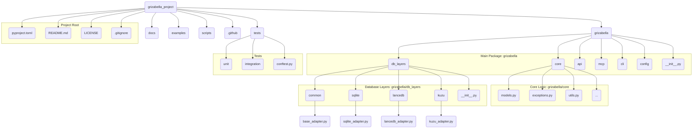
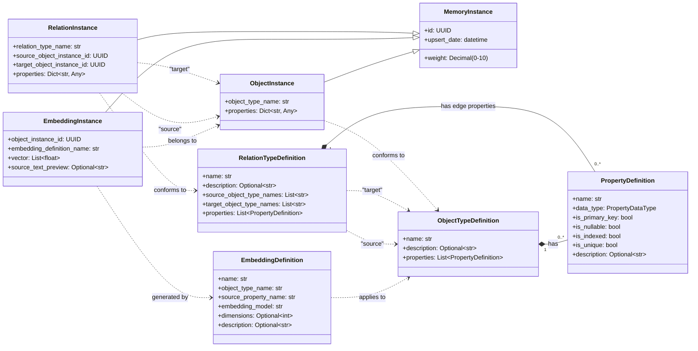

# Grizabella Project: Foundational Design Proposal

This document outlines the proposed initial design for the Grizabella project, covering project structure, dependency management, core data models, database location/connection management, and object identification.

## 1. Python Project Directory Structure

A well-organized directory structure is crucial for maintainability and scalability. I propose the following structure:



**Explanation:**

* **`grizabella/`**: The main Python package.
  * **`core/`**: Contains core data models (`models.py`), custom exceptions (`exceptions.py`), shared utilities (`utils.py`), and other fundamental business logic.
  * **`db_layers/`**: Manages interactions with the different database systems.
    * `common/`: Base classes, interfaces (e.g., `BaseDBAdapter`), or shared database logic.
    * `sqlite/`: SQLite-specific implementation.
    * `lancedb/`: LanceDB-specific implementation.
    * `kuzu/`: Kuzu-specific implementation.
  * **`api/`**: If Grizabella runs as a standalone app with an HTTP API (e.g., using FastAPI), this module will house the API-related code (routers, schemas for API, etc.).
  * **`mcp/`**: Implementation for the Grizabella MCP server.
  * **`cli/`**: Code for any command-line interface tools provided by Grizabella.
  * **`config/`**: Configuration management (e.g., loading, validation, default settings).
* **`tests/`**: Contains all tests.
  * `unit/`: Unit tests for individual modules/functions.
  * `integration/`: Integration tests for interactions between components (e.g., core logic with DB layers).
* **`docs/`**: Project documentation (e.g., Sphinx or MkDocs).
* **`examples/`**: Sample code and applications demonstrating how to use Grizabella as a library or standalone app.
* **`scripts/`**: Utility scripts for development, building, etc. (e.g., database migration scripts if needed in the future).
* **`.github/`**: (Optional) For GitHub Actions workflows (CI/CD).
* **`pyproject.toml`**: Project metadata and dependencies (see next section).
* **`README.md`**, **`LICENSE`**, **`.gitignore`**: Standard project files.

## 2. Dependency Management Recommendation

I recommend using **Poetry** for dependency management and packaging.

**Justification:**

* **Unified Tool:** Poetry handles dependency resolution, virtual environment management, packaging, and publishing within a single tool and a single `pyproject.toml` file.
* **Reproducible Builds:** It uses a `poetry.lock` file to ensure deterministic builds by locking dependency versions.
* **PEP Compliance:** It follows modern Python packaging standards (PEP 517, PEP 518, PEP 621).
* **Ease of Use:** Intuitive CLI for managing dependencies, building, and publishing packages.
* **Active Community:** Well-maintained and widely adopted.

PDM is also a strong contender, but Poetry's maturity and slightly broader adoption give it an edge for a new project aiming for robustness.

## 3. Core Data Models Design

I propose using Pydantic models for defining the core data structures. Pydantic provides data validation, serialization, and settings management with Python type annotations.

```python
from typing import List, Dict, Any, Optional, Union
from uuid import UUID, uuid4
from datetime import datetime, timezone
from pydantic import BaseModel, Field, condecimal, validator
from enum import Enum

# --- Enums ---
class PropertyDataType(str, Enum):
    TEXT = "TEXT"
    INTEGER = "INTEGER"
    FLOAT = "FLOAT"
    BOOLEAN = "BOOLEAN"
    DATETIME = "DATETIME"
    BLOB = "BLOB"
    JSON = "JSON"
    UUID = "UUID" # For explicit UUID type properties

# --- Base Metadata Model ---
class MemoryInstance(BaseModel):
    id: UUID = Field(default_factory=uuid4)
    weight: condecimal(ge=0, le=10, decimal_places=4) = Field(default=1.0)
    upsert_date: datetime = Field(default_factory=lambda: datetime.now(timezone.utc))

    class Config:
        validate_assignment = True # Ensure fields are validated on assignment

# --- Definition Models ---
class PropertyDefinition(BaseModel):
    name: str = Field(..., description="Name of the property (e.g., 'title', 'age').")
    data_type: PropertyDataType = Field(..., description="Data type of the property.")
    is_primary_key: bool = Field(default=False, description="Is this property a primary key for the object type?")
    is_nullable: bool = Field(default=True, description="Can this property be null?")
    is_indexed: bool = Field(default=False, description="Should this property be indexed in supporting databases?")
    is_unique: bool = Field(default=False, description="Does this property require unique values?")
    description: Optional[str] = Field(default=None, description="Optional description of the property.")

class ObjectTypeDefinition(BaseModel):
    name: str = Field(..., description="Unique name for the object type (e.g., 'Document', 'Person'). Convention: PascalCase.")
    description: Optional[str] = Field(default=None, description="Optional description of the object type.")
    properties: List[PropertyDefinition] = Field(..., description="List of properties defining this object type.")
    # _created_at: datetime = Field(default_factory=lambda: datetime.now(timezone.utc))
    # _updated_at: datetime = Field(default_factory=lambda: datetime.now(timezone.utc))

    @validator('properties')
    def check_primary_key_once(cls, v):
        pk_count = sum(1 for p in v if p.is_primary_key)
        if pk_count > 1:
            raise ValueError("An ObjectTypeDefinition can have at most one primary key property.")
        # If no explicit PK, 'id' from MemoryInstance will serve this role for ObjectInstance
        return v

class EmbeddingDefinition(BaseModel):
    name: str = Field(..., description="Unique name for this embedding configuration (e.g., 'content_embedding_v1'). Convention: snake_case.")
    object_type_name: str = Field(..., description="Name of the ObjectTypeDefinition this embedding applies to.")
    source_property_name: str = Field(..., description="Name of the property within the ObjectTypeDefinition whose content will be embedded.")
    embedding_model: str = Field(default="huggingface/mixedbread-ai/mxbai-embed-large-v1", description="Identifier for the embedding model to use.")
    dimensions: Optional[int] = Field(default=None, description="Expected dimensions of the embedding vector. If None, inferred from model.")
    description: Optional[str] = Field(default=None, description="Optional description of this embedding definition.")
    # _created_at: datetime = Field(default_factory=lambda: datetime.now(timezone.utc))
    # _updated_at: datetime = Field(default_factory=lambda: datetime.now(timezone.utc))

class RelationTypeDefinition(BaseModel):
    name: str = Field(..., description="Unique name for the relation type (e.g., 'HAS_AUTHOR', 'REFERENCES'). Convention: UPPER_SNAKE_CASE.")
    description: Optional[str] = Field(default=None, description="Optional description of the relation type.")
    source_object_type_names: List[str] = Field(..., description="List of allowed source ObjectTypeDefinition names.")
    target_object_type_names: List[str] = Field(..., description="List of allowed target ObjectTypeDefinition names.")
    properties: List[PropertyDefinition] = Field(default_factory=list, description="Properties of the relation itself (edge properties).")

# --- Instance Models ---
class ObjectInstance(MemoryInstance):
    object_type_name: str = Field(..., description="Name of the ObjectTypeDefinition this instance conforms to.")
    properties: Dict[str, Any] = Field(..., description="Actual data for the instance, mapping property names to values.")

class EmbeddingInstance(MemoryInstance):
    object_instance_id: UUID = Field(..., description="ID of the ObjectInstance this embedding belongs to.")
    embedding_definition_name: str = Field(..., description="Name of the EmbeddingDefinition used to generate this embedding.")
    vector: List[float] = Field(..., description="The embedding vector.")
    source_text_preview: Optional[str] = Field(default=None, max_length=256, description="A truncated preview of the source text used for embedding.")

class RelationInstance(MemoryInstance):
    relation_type_name: str = Field(..., description="Name of the RelationTypeDefinition this instance conforms to.")
    source_object_instance_id: UUID = Field(..., description="ID of the source ObjectInstance.")
    target_object_instance_id: UUID = Field(..., description="ID of the target ObjectInstance.")
    properties: Dict[str, Any] = Field(default_factory=dict, description="Actual data for the relation's properties.")
```

**Mermaid Diagram of Model Relationships:**



## 4. Database Location & Connection Management Strategy

**A. Database Location:**

* **Default Location:** `Path.home() / ".grizabella" / "default_db/"`
  * The `default_db` directory will house the files for SQLite, LanceDB, and Kuzu for the default Grizabella instance.
* **Named Databases:** `Path.home() / ".grizabella" / "<db_name>/"`
  * Allows users to manage multiple, isolated Grizabella database instances.
* **Custom Locations:** Users can specify an absolute path to a directory that will serve as a Grizabella database instance.
* **Internal Structure of a Grizabella DB Instance Directory (e.g., `~/.grizabella/my_project_db/`):**
  * `sqlite_data/grizabella.db` (SQLite database file)
  * `lancedb_data/` (Directory for LanceDB tables/indices)
  * `kuzu_data/` (Directory for Kuzu database files)
  * `grizabella_meta.json` (Optional: metadata about this specific Grizabella DB instance, schema versions, etc.)

**B. Connection Management:**

* A central `GrizabellaDB` class (or `DatabaseManager`) will be responsible for managing a single Grizabella database instance (i.e., a specific path as defined above).
* When instantiated with a database path, `GrizabellaDB` will:
    1. Determine the paths for SQLite, LanceDB, and Kuzu data within that main path.
    2. Initialize and hold connection objects/handlers for each of the three databases.
        * SQLite: `sqlite3.connect()`
        * LanceDB: `lancedb.connect()` to the LanceDB data directory.
        * Kuzu: `kuzu.Database()` with the Kuzu data directory.
    3. Provide methods to access these connections or adapters that wrap these connections.
* Schema Management:
  * `ObjectTypeDefinition`, `EmbeddingDefinition`, and `RelationTypeDefinition` will be stored, likely in the SQLite database as serialized JSON or in dedicated tables, to define the structure for all three layers.
  * The `GrizabellaDB` class would be responsible for ensuring schemas are consistently applied/migrated across the database layers when definitions are created or updated.
* A registry mechanism (perhaps a simple JSON file like `~/.grizabella/registry.json`) could list known Grizabella database instances (name and path) for easier discovery and management by tools or the Grizabella library itself.

## 5. Object Identification Strategy

* **Primary Identifier:** Use **UUIDs** for the `id` field in the `MemoryInstance` base model. This `id` will be the globally unique identifier for `ObjectInstance`s.
  * **Pydantic Type:** `uuid.UUID`
  * **Generation:** `default_factory=uuid.uuid4` (or `uuid.uuid7` if time-ordered UUIDs are preferred for potential performance benefits in some DB indexing scenarios, though `uuid4` is simpler and more common for pure randomness).
* **Consistency Across Layers:**
  * **SQLite:** The `ObjectInstance.id` (UUID) will be the primary key for the main table storing objects.
  * **LanceDB:** Embeddings (`EmbeddingInstance`) will store the `object_instance_id` (the UUID of the parent `ObjectInstance`) to link back. LanceDB can efficiently filter by UUIDs if stored appropriately (e.g., as a string or potentially a native UUID type if supported and beneficial).
  * **Kuzu:** `ObjectInstance.id` (UUID) will be used as the primary key for nodes representing these objects. Kuzu supports `UUID` as a data type. Relations (`RelationInstance`) will use these UUIDs to define `_from` and `_to` connections.
* This ensures that a single conceptual entity (an `ObjectInstance`) can be unambiguously referenced and linked across all three database backends.

## 6. Relation Creation Flow

The process of creating a relation instance has been refined to ensure data integrity, particularly within the Kuzu graph database. The flow is designed to guarantee that source and target nodes exist before a relationship is created between them.

The process is as follows:

1. **API Call:** The user calls the `add_relation()` method on the `Grizabella` client with a `RelationInstance` object.
2. **Delegation:** The client delegates this call to the `add_relation_instance()` method of the `GrizabellaDBManager`.
3. **Instance Management:** The `GrizabellaDBManager` further delegates to the `_InstanceManager`'s `add_relation_instance()` method.
4. **Node Pre-creation:** Before creating the relation, the `_InstanceManager` ensures that both the source and target nodes (object instances) exist in Kuzu. It does this by calling `upsert_object_instance()` on the `KuzuAdapter` for both the source and target object IDs from the `RelationInstance`. This step is idempotent; if the nodes already exist, Kuzu's `MERGE` operation does nothing, but if they don't, they are created.
5. **Relation Upsert:** Once the existence of both nodes is guaranteed, the `_InstanceManager` calls `upsert_relation_instance()` on the `KuzuAdapter`.
6. **Kuzu MERGE:** The `KuzuAdapter` executes a `MERGE` Cypher query to create the relationship between the source and target nodes. This operation is also idempotent.

This flow prevents errors that could arise from attempting to create a relationship between non-existent nodes.

```mermaid
sequenceDiagram
    participant Client as Grizabella Client
    participant DBManager as GrizabellaDBManager
    participant InstManager as _InstanceManager
    participant Kuzu as KuzuAdapter

    Client->>DBManager: add_relation(relation)
    DBManager->>InstManager: add_relation_instance(relation)
    InstManager->>Kuzu: upsert_object_instance(source_node)
    Kuzu-->>InstManager: Source Node Upserted
    InstManager->>Kuzu: upsert_object_instance(target_node)
    Kuzu-->>InstManager: Target Node Upserted
    InstManager->>Kuzu: upsert_relation_instance(relation)
    Kuzu-->>InstManager: Relation Upserted
    InstManager-->>DBManager: RelationInstance
    DBManager-->>Client: RelationInstance
end
```
