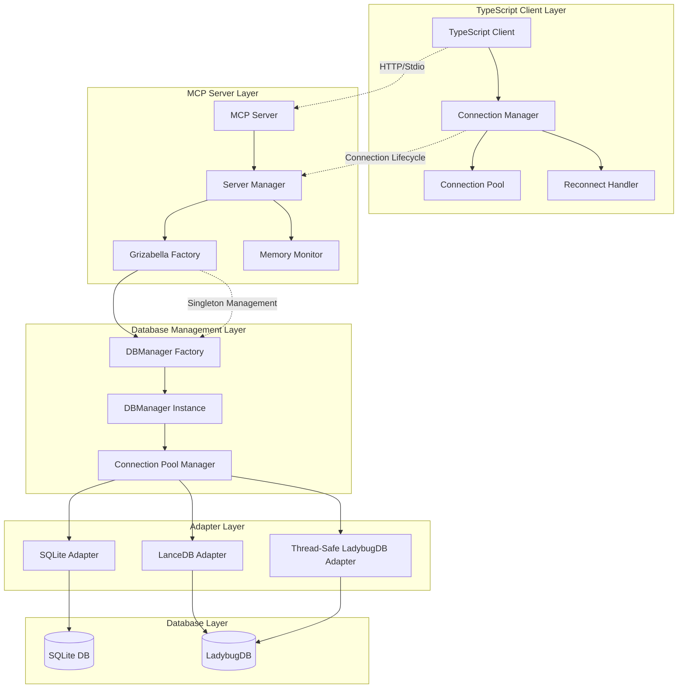

# Grizabella Memory Leak Fix - Comprehensive Connection Management Design

## Problem Analysis

### Root Cause Identification

Based on the codebase analysis, the memory leak and threading issues stem from several interconnected problems:

1. **Multiple Connection Instances**: Each TypeScript client connection creates new GrizabellaDBManager instances
2. **LadybugDBAdapter Threading Issues**: LadybugDB connections are not thread-safe and create lock files/WAL files that aren't properly cleaned up
3. **MCP Server Resource Leaks**: The MCP server creates singleton Grizabella instances but doesn't properly manage their lifecycle
4. **No Connection Pooling**: Database adapters are created per-request rather than reused
5. **Improper Cleanup**: Connection cleanup is inconsistent across different code paths

### Memory Leak Symptoms

- Over a dozen threads spawned for Grizabella process
- Uncontrollable memory growth leading to system crashes
- Lock files and WAL files accumulating in LadybugDB database directories
- MCP server connections not being properly terminated

## Solution Architecture

### Overview

The solution implements a comprehensive connection management system with:
- Thread-safe connection pooling
- Singleton pattern for database managers
- Proper resource lifecycle management
- Memory and thread monitoring
- Enhanced error handling and recovery

### Core Components

#### 1. Connection Pool Manager

```python
class ConnectionPoolManager:
    """Thread-safe connection pool for database adapters"""
    
    def __init__(self, max_connections: int = 10):
        self._pools = {
            'sqlite': Queue(maxsize=max_connections),
            'lancedb': Queue(maxsize=max_connections),
            'ladybugdb': Queue(maxsize=max_connections)
        }
        self._lock = threading.RLock()
        self._connection_count = defaultdict(int)
        
    async def get_connection(self, adapter_type: str, **kwargs):
        """Get a connection from the pool or create a new one"""
        
    async def return_connection(self, adapter_type: str, connection):
        """Return a connection to the pool"""
        
    async def cleanup_all(self):
        """Clean up all connections in the pool"""
```

#### 2. Singleton DBManager Factory

```python
class DBManagerFactory:
    """Factory for managing singleton GrizabellaDBManager instances"""
    
    _instances = {}
    _lock = threading.RLock()
    
    @classmethod
    def get_manager(cls, db_path: str, **kwargs) -> GrizabellaDBManager:
        """Get or create a singleton DBManager for the given database path"""
        
    @classmethod
    def cleanup_manager(cls, db_path: str):
        """Clean up a specific DBManager instance"""
        
    @classmethod
    def cleanup_all(cls):
        """Clean up all DBManager instances"""
```

#### 3. Thread-Safe LadybugDBAdapter

```python
class ThreadSafeLadybugDBAdapter(BaseDBAdapter):
    """Thread-safe LadybugDB adapter with proper connection isolation"""
    
    def __init__(self, db_path: str, config: Optional[dict] = None):
        self._local = threading.local()
        self._db_path = db_path
        self._config = config or {}
        self._lock = threading.RLock()
        
    @property
    def conn(self):
        """Get thread-local connection"""
        if not hasattr(self._local, 'conn'):
            self._local.conn = self._create_connection()
        return self._local.conn
        
    def _create_connection(self):
        """Create a new LadybugDB connection with proper cleanup"""
        
    def close(self):
        """Close thread-local connection"""
```

#### 4. Enhanced MCP Server Lifecycle

```python
class MCPServerManager:
    """Enhanced MCP server with proper resource management"""
    
    def __init__(self):
        self._grizabella_client = None
        self._shutdown_handlers = []
        self._monitoring_thread = None
        
    async def start_server(self, db_path: str):
        """Start server with proper initialization"""
        
    async def shutdown_server(self):
        """Graceful shutdown with resource cleanup"""
        
    def _setup_monitoring(self):
        """Setup memory and thread monitoring"""
```

#### 5. TypeScript Client Connection Management

```typescript
class ConnectionManager {
    private _connectionPool: Map<string, MCPClient> = new Map();
    private _reconnectTimers: Map<string, NodeJS.Timeout> = new Map();
    private _connectionState: Map<string, ConnectionState> = new Map();
    
    async getConnection(config: GrizabellaClientConfig): Promise<MCPClient> {
        const key = this._getConnectionKey(config);
        
        if (this._connectionPool.has(key)) {
            const client = this._connectionPool.get(key)!;
            if (client.isConnected()) {
                return client;
            }
            this._cleanupConnection(key);
        }
        
        return this._createConnection(key, config);
    }
    
    private async _createConnection(key: string, config: GrizabellaClientConfig): Promise<MCPClient> {
        const client = new MCPClient(config);
        await client.connect();
        this._connectionPool.set(key, client);
        this._connectionState.set(key, ConnectionState.CONNECTED);
        return client;
    }
    
    async cleanupAll(): Promise<void> {
        for (const [key, client] of this._connectionPool) {
            await this._cleanupConnection(key);
        }
    }
}
```

## Implementation Plan

### Phase 1: Core Infrastructure

1. **Connection Pool Manager Implementation**
   - Thread-safe queue-based pooling
   - Connection health checks
   - Automatic cleanup of idle connections

2. **DBManager Factory**
   - Singleton pattern with thread safety
   - Reference counting for shared instances
   - Graceful shutdown procedures

3. **Enhanced LadybugDBAdapter**
    - Thread-local storage for connections
    - Proper lock file management
    - WAL file cleanup on connection close

### Phase 2: MCP Server Enhancements

1. **Server Lifecycle Management**
   - Proper initialization and shutdown sequences
   - Resource cleanup handlers
   - Graceful error recovery

2. **Memory Monitoring**
   - Thread tracking
   - Memory usage monitoring
   - Alert system for resource leaks

### Phase 3: Client-Side Improvements

1. **TypeScript Connection Manager**
   - Connection pooling
   - Auto-reconnect logic
   - Connection state management

2. **Enhanced Error Handling**
   - Connection failure recovery
   - Exponential backoff for retries
   - Circuit breaker pattern

### Phase 4: Testing and Documentation

1. **Comprehensive Test Suite**
   - Unit tests for all components
   - Integration tests for connection lifecycle
   - Load testing for memory leak validation

2. **Documentation Updates**
   - Connection management best practices
   - Troubleshooting guide
   - API documentation updates

## Mermaid Architecture Diagram



## Benefits of This Solution

1. **Memory Leak Prevention**: Proper resource cleanup and connection pooling
2. **Thread Safety**: Thread-local connections and proper synchronization
3. **Scalability**: Connection pooling allows better resource utilization
4. **Reliability**: Enhanced error handling and automatic recovery
5. **Monitoring**: Built-in memory and thread tracking
6. **Maintainability**: Clear separation of concerns and modular design

## Backward Compatibility

The solution maintains backward compatibility by:
- Preserving existing API interfaces
- Adding new optional parameters for connection management
- Providing migration path for existing code
- Supporting both old and new connection patterns during transition

## Performance Considerations

- Connection pooling reduces connection overhead
- Thread-local storage minimizes contention
- Lazy initialization reduces startup time
- Health checks prevent using stale connections
- Resource limits prevent resource exhaustion

## Security Considerations

- Connection isolation prevents data leakage between threads
- Proper cleanup prevents sensitive data retention
- Resource limits prevent DoS attacks
- Monitoring helps detect unusual activity patterns