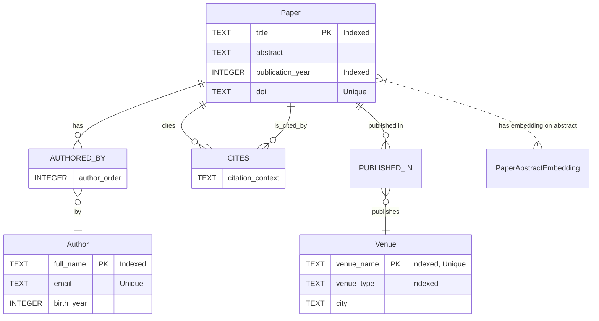

# Grizabella Engine: End-to-End Test Scenario Design (Subtask X.1)

## 1. Introduction & Goal

This document outlines a comprehensive end-to-end test scenario for the Grizabella engine. The primary goal is to validate the engine's functionality across its core layers (SQLite, LanceDB, LadybugDB) and the unified Python API (`Grizabella` client) without using any mocks. This test will cover schema definition, data population, complex querying, data modification, and re-querying to ensure inter-layer consistency and overall system integrity.

The scenario will use a "Scientific Publications" domain, involving Authors, Papers, and Venues, along with their relationships.

## 2. Test Environment Setup

### 2.1. Grizabella Client Initialization

The test script will begin by initializing the `Grizabella` client.

- **Action:** Instantiate the `Grizabella` client, configured to use a **fresh, temporary database instance**. This typically involves providing a unique database path or name that the client will create and manage.
- **Verification:** Ensure the client connects successfully and the temporary database files/directories are created.

## 3. Schema Definition

The following schema will be created using the `Grizabella` client's API methods (e.g., `create_object_type`, `create_embedding_definition`, `create_relation_type`).

### 3.1. `ObjectTypeDefinition`s

1. **`Author`**
    - `name`: "Author"
    - `description`: "Represents a researcher or author of a scientific paper."
    - `properties`:
        - `name`: "full_name", `data_type`: `PropertyDataType.TEXT`, `is_indexed`: True, `is_nullable`: False
        - `email`: "email", `data_type`: `PropertyDataType.TEXT`, `is_unique`: True, `is_nullable`: True
        - `birth_year`: "birth_year", `data_type`: `PropertyDataType.INTEGER`, `is_nullable`: True

2. **`Paper`**
    - `name`: "Paper"
    - `description`: "Represents a scientific publication."
    - `properties`:
        - `name`: "title", `data_type`: `PropertyDataType.TEXT`, `is_indexed`: True, `is_nullable`: False
        - `name`: "abstract", `data_type`: `PropertyDataType.TEXT`, `is_nullable`: True
        - `name`: "publication_year", `data_type`: `PropertyDataType.INTEGER`, `is_indexed`: True, `is_nullable`: False
        - `name`: "doi", `data_type`: `PropertyDataType.TEXT`, `is_unique`: True, `is_nullable`: True

3. **`Venue`**
    - `name`: "Venue"
    - `description`: "Represents a journal, conference, or workshop where papers are published."
    - `properties`:
        - `name`: "venue_name", `data_type`: `PropertyDataType.TEXT`, `is_indexed`: True, `is_unique`: True, `is_nullable`: False
        - `name`: "venue_type", `data_type`: `PropertyDataType.TEXT`, `is_indexed`: True, `is_nullable`: False (e.g., "Journal", "Conference")
        - `name`: "city", `data_type`: `PropertyDataType.TEXT`, `is_nullable`: True

### 3.2. `EmbeddingDefinition`(s)

1. **`PaperAbstractEmbedding`**
    - `name`: "PaperAbstractEmbedding"
    - `object_type_name`: "Paper"
    - `source_property_name`: "abstract"
    - `embedding_model`: "huggingface/mixedbread-ai/mxbai-embed-large-v1" (default, or specify if different)
    - `description`: "Embedding for the abstract of papers."

### 3.3. `RelationTypeDefinition`(s)

1. **`AUTHORED_BY`**
    - `name`: "AUTHORED_BY"
    - `description`: "Connects a Paper to its Author(s)."
    - `source_object_type_names`: ["Paper"]
    - `target_object_type_names`: ["Author"]
    - `properties`:
        - `name`: "author_order", `data_type`: `PropertyDataType.INTEGER`, `is_nullable`: True, `description`: "Order of authorship (e.g., 1 for first author)."

2. **`CITES`**
    - `name`: "CITES"
    - `description`: "Connects a Paper to another Paper it cites."
    - `source_object_type_names`: ["Paper"]
    - `target_object_type_names`: ["Paper"]
    - `properties`:
        - `name`: "citation_context", `data_type`: `PropertyDataType.TEXT`, `is_nullable`: True, `description`: "Brief context or reason for citation."

3. **`PUBLISHED_IN`**
    - `name`: "PUBLISHED_IN"
    - `description`: "Connects a Paper to the Venue it was published in."
    - `source_object_type_names`: ["Paper"]
    - `target_object_type_names`: ["Venue"]
    - `properties`: []

### 3.4. Schema Diagram (Mermaid)



## 4. Sample Data Population

The following sample data will be inserted using `Grizabella` client's API methods (e.g., `add_object_instance`, `add_relation_instance`). UUIDs will be generated by the system or can be pre-defined for predictability in tests. For simplicity, we'll assume UUIDs are `author_id_1`, `paper_id_1`, etc.

### 4.1. `Author` Instances

- **Author 1:**
  - `id`: `author_id_1`
  - `object_type_name`: "Author"
  - `properties`: `{"full_name": "Dr. Alice Wonderland", "email": "alice@example.com", "birth_year": 1980}`

- **Author 2:**
  - `id`: `author_id_2`
  - `object_type_name`: "Author"
  - `properties`: `{"full_name": "Dr. Bob The Builder", "email": "bob@example.com", "birth_year": 1975}`
- **Author 3:**
  - `id`: `author_id_3`
  - `object_type_name`: "Author"
  - `properties`: `{"full_name": "Dr. Carol Danvers", "email": "carol@example.com", "birth_year": 1985}`

### 4.2. `Venue` Instances

- **Venue 1:**
  - `id`: `venue_id_1`
  - `object_type_name`: "Venue"
  - `properties`: `{"venue_name": "Journal of Fantastical AI", "venue_type": "Journal", "city": "Virtual"}`

- **Venue 2:**
  - `id`: `venue_id_2`
  - `object_type_name`: "Venue"
  - `properties`: `{"venue_name": "Conference on Practical Magic", "venue_type": "Conference", "city": "New Orleans"}`

### 4.3. `Paper` Instances

- **Paper 1:**
  - `id`: `paper_id_1`
  - `object_type_name`: "Paper"
  - `properties`: `{"title": "Advanced Gryphon Behavior", "abstract": "This seminal paper explores the intricate and often misunderstood social structures within modern gryphon populations. We present a novel longitudinal dataset, collected over five years, and employ advanced statistical modeling to analyze their complex mating rituals and hierarchical dynamics. Our findings challenge previous assumptions about gryphon territoriality and communication patterns.", "publication_year": 2023, "doi": "10.1000/jfa.2023.001"}`

- **Paper 2:**
  - `id`: `paper_id_2`
  - `object_type_name`: "Paper"
  - `properties`: `{"title": "The Aerodynamics of Broomsticks", "abstract": "An in-depth computational and experimental study of broomstick flight dynamics, considering the interplay of magical enchantments and traditional material science. Various wood types and enchantment patterns were tested. Results indicate a strong, statistically significant correlation between willow wood construction and enhanced flight stability, particularly in turbulent conditions.", "publication_year": 2022, "doi": "10.2000/cpm.2022.002"}`
- **Paper 3:**
  - `id`: `paper_id_3`
  - `object_type_name`: "Paper"
  - `properties`: `{"title": "Quantum Entanglement in Potion Brewing", "abstract": "We investigate the previously hypothesized role of quantum mechanical effects in the efficacy of advanced potion-making. This research specifically focuses on entanglement-assisted ingredient mixing protocols. Our experimental results suggest that leveraging quantum entanglement can significantly enhance potion potency and reduce brewing time, potentially revolutionizing alchemical practices.", "publication_year": 2023, "doi": "10.1000/jfa.2023.003"}`
- **Paper 4 (for citation by Paper 1):**
  - `id`: `paper_id_4`
  - `object_type_name`: "Paper"
  - `properties`: `{"title": "A History of Mythical Creatures", "abstract": "A foundational and comprehensive text on the historical study of mythical creatures across various cultures. This volume includes detailed chapters on early gryphon observations, their symbolism in ancient art, and documented interactions with human societies. It serves as a critical reference for researchers in cryptozoology and mythological studies.", "publication_year": 2010, "doi": "10.3000/hmc.2010.004"}`

### 4.4. `RelationInstance`s

- **AUTHORED_BY:**
    1. `source_object_instance_id`: `paper_id_1`, `target_object_instance_id`: `author_id_1`, `properties`: `{"author_order": 1}`
    2. `source_object_instance_id`: `paper_id_1`, `target_object_instance_id`: `author_id_2`, `properties`: `{"author_order": 2}`
    3. `source_object_instance_id`: `paper_id_2`, `target_object_instance_id`: `author_id_2`, `properties`: `{"author_order": 1}`
    4. `source_object_instance_id`: `paper_id_3`, `target_object_instance_id`: `author_id_1`, `properties`: `{"author_order": 1}`
    5. `source_object_instance_id`: `paper_id_3`, `target_object_instance_id`: `author_id_3`, `properties`: `{"author_order": 2}`
    6. `source_object_instance_id`: `paper_id_4`, `target_object_instance_id`: `author_id_3`, `properties`: `{"author_order": 1}`

- **CITES:**
    1. `source_object_instance_id`: `paper_id_1`, `target_object_instance_id`: `paper_id_4`, `properties`: `{"citation_context": "Builds upon foundational gryphon observations and historical accounts."}`
    2. `source_object_instance_id`: `paper_id_3`, `target_object_instance_id`: `paper_id_2`, `properties`: `{"citation_context": "Compares quantum effects in potions to observed magical flight principles in broomsticks."}`
- **PUBLISHED_IN:**
    1. `source_object_instance_id`: `paper_id_1`, `target_object_instance_id`: `venue_id_1`
    2. `source_object_instance_id`: `paper_id_2`, `target_object_instance_id`: `venue_id_2`
    3. `source_object_instance_id`: `paper_id_3`, `target_object_instance_id`: `venue_id_1`
    4. `source_object_instance_id`: `paper_id_4`, `target_object_instance_id`: `venue_id_1` (assuming it's an older paper from the same journal)

## 5. Initial Complex Queries & Expected Outcomes

Queries will be constructed using the `ComplexQuery`, `QueryComponent`, `RelationalFilter`, `EmbeddingSearchClause`, and `GraphTraversalClause` models from `grizabella/core/query_models.py`.
*(Assume a helper function `get_embedding_vector(text: str) -> list[float]` exists for generating query embeddings.)*

### 5.1. Query 1: Find papers by Dr. Alice Wonderland published in 2023, with abstracts similar to "gryphon social structures and mating rituals"

- **Description:** "Alice's 2023 papers on gryphon social behavior"
- **`ComplexQuery` Structure:**

    ```python
    ComplexQuery(
        description="Alice's 2023 papers on gryphon social behavior",
        components=[
            QueryComponent(
                object_type_name="Paper",
                relational_filters=[
                    RelationalFilter(property_name="publication_year", operator="==", value=2023)
                ],
                embedding_searches=[
                    EmbeddingSearchClause(
                        embedding_definition_name="PaperAbstractEmbedding",
                        similar_to_payload=get_embedding_vector("gryphon social structures and mating rituals"), # Placeholder
                        limit=5,
                        threshold=0.7 # Example threshold
                    )
                ],
                graph_traversals=[
                    GraphTraversalClause(
                        relation_type_name="AUTHORED_BY",
                        direction="outgoing",
                        target_object_type_name="Author",
                        target_object_properties=[
                            RelationalFilter(property_name="full_name", operator="==", value="Dr. Alice Wonderland")
                        ]
                    )
                ]
            )
        ]
    )
    ```

- **Expected Results:** `[paper_id_1]` (Advanced Gryphon Behavior)

### 5.2. Query 2: Find papers co-authored by Dr. Bob The Builder and Dr. Alice Wonderland, AND these papers cite 'A History of Mythical Creatures' (paper_id_4)

- **Description:** "Papers by Bob & Alice citing Paper 4"
- **`ComplexQuery` Structure:**

    ```python
    ComplexQuery(
        description="Papers by Bob & Alice citing Paper 4",
        components=[
            QueryComponent(
                object_type_name="Paper",
                graph_traversals=[
                    GraphTraversalClause( # Co-authored by Bob
                        relation_type_name="AUTHORED_BY",
                        direction="outgoing",
                        target_object_type_name="Author",
                        target_object_properties=[
                            RelationalFilter(property_name="full_name", operator="==", value="Dr. Bob The Builder")
                        ]
                    ),
                    GraphTraversalClause( # Co-authored by Alice
                        relation_type_name="AUTHORED_BY",
                        direction="outgoing",
                        target_object_type_name="Author",
                        target_object_properties=[
                            RelationalFilter(property_name="full_name", operator="==", value="Dr. Alice Wonderland")
                        ]
                    ),
                    GraphTraversalClause( # Cites paper_id_4
                        relation_type_name="CITES",
                        direction="outgoing",
                        target_object_type_name="Paper",
                        target_object_id=paper_id_4 # Assuming paper_id_4 is a known UUID
                    )
                ]
            )
        ]
    )
    ```

- **Expected Results:** `[paper_id_1]` (Advanced Gryphon Behavior is authored by Alice & Bob, and cites Paper 4)

### 5.3. Query 3: Find Papers published in 'Journal of Fantastical AI' (venue_id_1) with abstracts similar to 'potion brewing ingredients and quantum effects', AND authored by an author born after 1980

- **Description:** "JFA papers on quantum potions by younger authors"
- **`ComplexQuery` Structure:**

    ```python
    ComplexQuery(
        description="JFA papers on quantum potions by younger authors",
        components=[
            QueryComponent(
                object_type_name="Paper",
                embedding_searches=[
                    EmbeddingSearchClause(
                        embedding_definition_name="PaperAbstractEmbedding",
                        similar_to_payload=get_embedding_vector("potion brewing ingredients and quantum effects"),
                        limit=3
                    )
                ],
                graph_traversals=[
                    GraphTraversalClause( # Published in JFA
                        relation_type_name="PUBLISHED_IN",
                        direction="outgoing",
                        target_object_type_name="Venue",
                        target_object_id=venue_id_1 # venue_id_1 for "Journal of Fantastical AI"
                    ),
                    GraphTraversalClause( # Authored by someone born after 1980
                        relation_type_name="AUTHORED_BY",
                        direction="outgoing",
                        target_object_type_name="Author",
                        target_object_properties=[
                            RelationalFilter(property_name="birth_year", operator=">", value=1980)
                        ]
                    )
                ]
            )
        ]
    )
    ```

- **Expected Results:** `[paper_id_3]` (Quantum Entanglement in Potion Brewing, by Alice (b.1980 - no, not >1980) and Carol (b.1985 - yes!). Published in JFA (venue_id_1). Abstract is about potion brewing and quantum effects.)

## 6. Data Modification Operations

Perform the following operations using the `Grizabella` client API (e.g., `update_object_instance`, `add_relation_instance`, `delete_relation_instance`).

1. **Update `ObjectInstance` Property (triggering re-embedding):**
    - **Action:** Update `Paper` instance `paper_id_1`.
        - Change `properties["abstract"]` from its current long version to: "A new groundbreaking study on ancient dragon linguistics and their surprising connection to early forms of magical spells. This research focuses on deciphering complex draconic syntax and its implications for understanding the evolution of incantations. We also explore potential phonetic links to modern magical traditions."
    - **Verification:** The `PaperAbstractEmbedding` for `paper_id_1` should be updated/recomputed by the system.

2. **Add New `RelationInstance`:**
    - **Action:** Add a new `CITES` relation: `paper_id_2` now also cites `paper_id_4`.
        - `relation_type_name`: "CITES"
        - `source_object_instance_id`: `paper_id_2`
        - `target_object_instance_id`: `paper_id_4`
        - `properties`: `{"citation_context": "Provides further historical background on magical artifacts relevant to broomstick enchantments."}`
    - **Verification:** The new relation exists.

3. **Delete `RelationInstance`:**
    - **Action:** Delete an existing `AUTHORED_BY` relation: Dr. Bob The Builder (`author_id_2`) is no longer an author of `paper_id_1`.
        - Find the `RelationInstance` for `AUTHORED_BY` where `source_object_instance_id == paper_id_1` and `target_object_instance_id == author_id_2`. Delete it.
    - **Verification:** The relation is removed.

4. **Update `RelationInstance` Property:**
    - **Action:** Update the `CITES` relation between `paper_id_1` and `paper_id_4`.
        - Change `properties["citation_context"]` from "Builds upon foundational gryphon observations and historical accounts." to "Corrects earlier misinterpretations of gryphon vocalizations detailed in paper_id_4, offering a new linguistic analysis."
    - **Verification:** The relation property is updated.

5. **(Optional) Delete `ObjectInstance`:** (OMITTED as per previous decision to simplify post-modification query comparison)

## 7. Post-Modification Complex Queries & Expected Outcomes

### 7.1. Re-run Query 1 (Find papers by Dr. Alice Wonderland published in 2023, with abstracts similar to "gryphon social structures and mating rituals")

- **Original Query 1 Structure (repeated for clarity):**

    ```python
    ComplexQuery(
        description="Alice's 2023 papers on gryphon social behavior",
        components=[
            QueryComponent(
                object_type_name="Paper",
                relational_filters=[
                    RelationalFilter(property_name="publication_year", operator="==", value=2023)
                ],
                embedding_searches=[
                    EmbeddingSearchClause(
                        embedding_definition_name="PaperAbstractEmbedding",
                        similar_to_payload=get_embedding_vector("gryphon social structures and mating rituals"),
                        limit=5,
                        threshold=0.7
                    )
                ],
                graph_traversals=[
                    GraphTraversalClause(
                        relation_type_name="AUTHORED_BY",
                        direction="outgoing",
                        target_object_type_name="Author",
                        target_object_properties=[
                            RelationalFilter(property_name="full_name", operator="==", value="Dr. Alice Wonderland")
                        ]
                    )
                ]
            )
        ]
    )
    ```

- **Expected Results (Post-Modification):** `[]` (empty list). `paper_id_1`'s abstract was changed to be about "dragon linguistics", so it should no longer match "gryphon social structures and mating rituals".

### 7.2. Re-run Query 2 (Alternative: Find papers co-authored by Dr. Bob The Builder and Dr. Alice Wonderland, AND these papers cite 'A History of Mythical Creatures' (paper_id_4))

- **Original Query 2 Structure (repeated for clarity):**

    ```python
    ComplexQuery(
        description="Papers by Bob & Alice citing Paper 4",
        components=[
            QueryComponent(
                object_type_name="Paper",
                graph_traversals=[
                    GraphTraversalClause(
                        relation_type_name="AUTHORED_BY",
                        direction="outgoing",
                        target_object_type_name="Author",
                        target_object_properties=[
                            RelationalFilter(property_name="full_name", operator="==", value="Dr. Bob The Builder")
                        ]
                    ),
                    GraphTraversalClause(
                        relation_type_name="AUTHORED_BY",
                        direction="outgoing",
                        target_object_type_name="Author",
                        target_object_properties=[
                            RelationalFilter(property_name="full_name", operator="==", value="Dr. Alice Wonderland")
                        ]
                    ),
                    GraphTraversalClause(
                        relation_type_name="CITES",
                        direction="outgoing",
                        target_object_type_name="Paper",
                        target_object_id=paper_id_4
                    )
                ]
            )
        ]
    )
    ```

- **Expected Results (Post-Modification):** `[]` (empty list). `paper_id_1` is no longer authored by Dr. Bob The Builder.

### 7.3. New Query 4: Find papers that now cite "A History of Mythical Creatures" (paper_id_4) and were published in "Conference on Practical Magic" (venue_id_2)

- **Description:** "Papers in CPM citing Paper 4"
- **`ComplexQuery` Structure:**

    ```python
    ComplexQuery(
        description="Papers in CPM citing Paper 4",
        components=[
            QueryComponent(
                object_type_name="Paper",
                graph_traversals=[
                    GraphTraversalClause( # Cites paper_id_4
                        relation_type_name="CITES",
                        direction="outgoing",
                        target_object_type_name="Paper",
                        target_object_id=paper_id_4
                    ),
                    GraphTraversalClause( # Published in venue_id_2
                        relation_type_name="PUBLISHED_IN",
                        direction="outgoing",
                        target_object_type_name="Venue",
                        target_object_id=venue_id_2 # venue_id_2 for "Conference on Practical Magic"
                    )
                ]
            )
        ]
    )
    ```

- **Expected Results:** `[paper_id_2]` (`paper_id_2` was modified to cite `paper_id_4` and was already published in `venue_id_2`).

## 8. Cleanup

### 8.1. Close Grizabella Client

- **Action:** Call the appropriate method on the `Grizabella` client to close the connection and release resources (e.g., `client.close()`).

- **Verification:** Client indicates successful closure.

### 8.2. Verify Temporary Database Deletion

- **Action:** The test script or a teardown fixture should ensure the temporary database files/directories created at the start are removed.

- **Verification:** Check the filesystem to confirm deletion.

## 9. Conceptual Python Test Script Outline

```python
import unittest
import tempfile
import shutil
from uuid import UUID # and other necessary imports
from grizabella.api.client import Grizabella
from grizabella.core.models import (
    ObjectTypeDefinition, PropertyDefinition, PropertyDataType,
    EmbeddingDefinition, RelationTypeDefinition, ObjectInstance, RelationInstance
)
from grizabella.core.query_models import (
    ComplexQuery, QueryComponent, RelationalFilter,
    EmbeddingSearchClause, GraphTraversalClause
)

# Placeholder for actual UUIDs or a generation mechanism
# paper_id_1, author_id_1, venue_id_1, etc. will be actual UUID objects

def get_embedding_vector(text: str) -> list[float]:
    # In a real test, this might call a mock embedding service or use a fixed vector
    # For this design, we assume it's available.
    # For a true no-mock test, the Grizabella instance would generate this.
    # The client API might not expose direct embedding generation for arbitrary text,
    # but rather relies on EmbeddingDefinitions.
    # For query purposes, if similar_to_payload is used, the vector must be pre-computed.
    # This implies the test might need a way to get an embedding for the query text
    # perhaps by creating a dummy object with that text and retrieving its embedding,
    # or the Grizabella client needs a utility for this.
    # For now, let's assume a placeholder vector.
    return [0.1] * 128 # Example dimension, ensure this matches the model's output

class TestGrizabellaE2E(unittest.TestCase):

    def setUp(self):
        self.db_path = tempfile.mkdtemp(prefix="grizabella_e2e_test_")
        self.client = Grizabella(database_path=self.db_path) # Adjust init as per actual API
        # Define IDs for easier reference (or generate and store them)
        # self.author_id_1 = UUID("...") # Pre-defined or generated
        # ... other IDs

        # Phase 1: Schema Definition
        self._define_schema()

        # Phase 2: Data Population
        self._populate_data()

    def _define_schema(self):
        # Create ObjectTypeDefinitions (Author, Paper, Venue)
        # ... client.create_object_type(...) for each
        # Create EmbeddingDefinition (PaperAbstractEmbedding)
        # ... client.create_embedding_definition(...)
        # Create RelationTypeDefinitions (AUTHORED_BY, CITES, PUBLISHED_IN)
        # ... client.create_relation_type(...) for each
        pass

    def _populate_data(self):
        # Add ObjectInstances (Authors, Venues, Papers)
        # ... client.add_object_instance(...) for each
        # Add RelationInstances (AUTHORED_BY, CITES, PUBLISHED_IN)
        # ... client.add_relation_instance(...) for each
        pass

    def test_full_scenario(self):
        # Phase 3: Initial Complex Queries
        self._run_initial_queries()

        # Phase 4: Data Modification
        self._modify_data()

        # Phase 5: Post-Modification Complex Queries
        self._run_post_modification_queries()

    def _run_initial_queries(self):
        # Query 1
        # ... construct query_1_obj
        # results_q1 = self.client.execute_complex_query(query_1_obj)
        # self.assert_results(results_q1, expected_ids=[self.paper_id_1])

        # Query 2 (Alternative)
        # ... construct query_2_obj
        # results_q2 = self.client.execute_complex_query(query_2_obj)
        # self.assert_results(results_q2, expected_ids=[self.paper_id_1])

        # Query 3 (New)
        # ... construct query_3_obj
        # results_q3 = self.client.execute_complex_query(query_3_obj)
        # self.assert_results(results_q3, expected_ids=[self.paper_id_3])
        pass

    def _modify_data(self):
        # Update Paper abstract (paper_id_1)
        # ... self.client.update_object_instance(...)
        # Add CITES relation (paper_id_2 -> paper_id_4)
        # ... self.client.add_relation_instance(...)
        # Delete AUTHORED_BY relation (paper_id_1, author_id_2)
        # ... self.client.delete_relation_instance(...)
        # Update CITES relation property (paper_id_1, paper_id_4)
        # ... self.client.update_relation_instance(...)
        pass

    def _run_post_modification_queries(self):
        # Re-run Query 1
        # ... construct query_1_obj (same as before)
        # results_q1_mod = self.client.execute_complex_query(query_1_obj)
        # self.assert_results(results_q1_mod, expected_ids=[])

        # Re-run Query 2 (Alternative)
        # ... construct query_2_obj (same as before)
        # results_q2_mod = self.client.execute_complex_query(query_2_obj)
        # self.assert_results(results_q2_mod, expected_ids=[])

        # New Query 4
        # ... construct query_4_obj
        # results_q4 = self.client.execute_complex_query(query_4_obj)
        # self.assert_results(results_q4, expected_ids=[self.paper_id_2])
        pass

    def assert_results(self, query_result, expected_ids):
        # Helper to check query_result.object_instances against expected_ids
        # self.assertIsNone(query_result.errors)
        # fetched_ids = {obj.id for obj in query_result.object_instances}
        # self.assertEqual(fetched_ids, set(expected_ids))
        pass

    def tearDown(self):
        if self.client:
            self.client.close() # Adjust as per actual API
        if hasattr(self, 'db_path') and self.db_path:
            shutil.rmtree(self.db_path)

if __name__ == '__main__':
    unittest.main()
